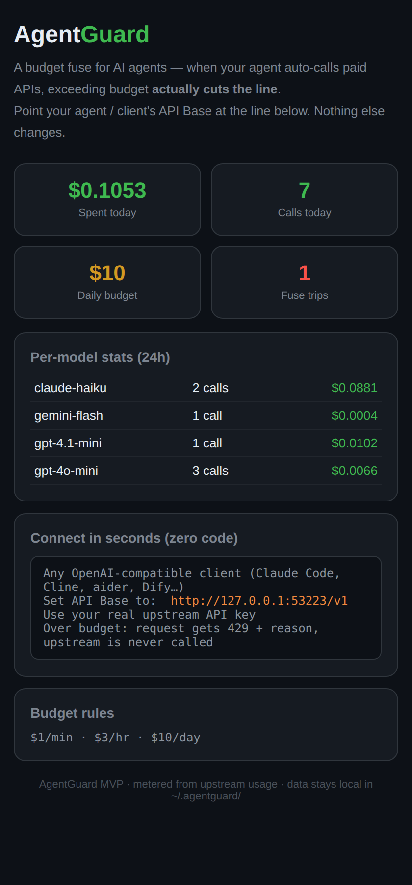

# AgentGuard

<p align="center"></p>

**Budget fuse for AI agents.** A ~200-line pure-stdlib Python proxy that
sits between any OpenAI-compatible agent (Claude Code, Cline, aider,
custom agents) and its paid API upstream. It meters every call, enforces
per-minute / hourly / daily budgets, and **hard-cuts** traffic (HTTP 429)
when a budget is exceeded.

Stop finding out your agent burned ¥50 overnight *after* it happened.

## Install

```sh
curl -fsSL https://3d28.com/downloads/agentguard-install.sh | sh
```

Then point your agent's API Base at `http://127.0.0.1:53110/v1` and use
your real upstream key. Live panel: <http://127.0.0.1:53110/>

## Features

- **Zero SDK intrusion** — any OpenAI-compatible client works unchanged
- **Three-tier fuse** — per-minute / hourly / daily budget cutoffs
- **Live cost panel** — web dashboard at `/`, plain-text version at `/txt`
- **Warnings** — `X-AgentGuard-Warning` header at 50/80/95% of budget
- **Webhook alerts** — one JSON POST per level per day (WeChat push,
  ServerChan, Slack, …)
- **Per-model pricing** — env overrides, unknown models fall back to a
  conservative default

## Security promise

- Listens on `127.0.0.1` only — never network-exposed
- API keys live in local memory only; never written to disk, never
  reported anywhere
- Records only token counts and costs into a local SQLite
  (`~/.agentguard/usage.db`)
- Single file, pure Python stdlib, ~200 lines — read the whole thing
  before you trust it

## As an agent skill

Install as a [SKILL.md](SKILL.md) agent skill so your agent sets it up
itself:

```sh
npx skills add <your-username>/agentguard-skill
```

## Configuration

Edit `~/.agentguard/env`:

```sh
AG_UPSTREAM=https://api.deepseek.com   # any OpenAI-compatible base
AG_BUDGET_DAY=10                       # daily budget (CNY)
AG_BUDGET_HOUR=3
AG_BUDGET_MIN=1
AG_WARN_PCT=80                         # warning threshold
AG_WEBHOOK_URL=https://...             # optional alert webhook
AG_PRICE_DEEPSEEK_CHAT=2.0,8.0         # in/out ¥ per 1M tokens
```

## License

MIT

---

## Related Projects

- **[memory-kit](https://github.com/omg9999142536/memorykit)** 🧠 — A memory architecture for AI agents: orthogonal axes, daily GC, hash-chained clock, heartbeat panel. Built from the same production system.


---

## Support / 赞助

If AgentGuard saves your token budget, consider buying me a coffee ☕

- **Buy the Pro license (¥9.9)** or just say thanks: [afdian.com/a/3d28com](https://afdian.com/a/3d28com)
